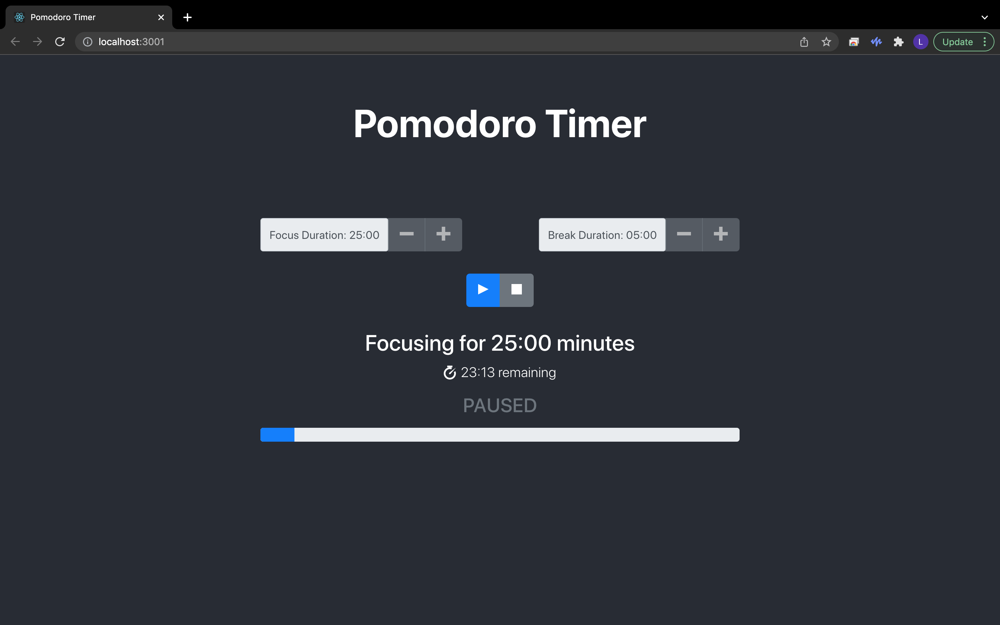

# Pomodoro Timer Application

A simplified version of Cirillo's original Pomodoro technique, a time-management method which involves using a timer to break down work into intervals, traditionally 25 minutes in length, separated by short breaks designed to be a great study tool enabling a user to set a focus duration and a break duration. 

### Screenshot

### Highlights
* The initial screen lets the user set the length of the focus and break and break sessions
* After the user clicks the "play" button, the buttons to change the focus and break duration are disabled, and the session timer appears
* If the user clicks the "pause" button, "paused" appears below the time remaining

### Learning objectives
Rendering and state management using React

* Installing packages via NPM
* Running tests from the command line
* Writing React function components
* Using hooks like useState()
* Debugging React code through console output

### Key Technologies  
* HTML5
* CSS with Bootstrap
* JavaScript
* React

### Installation
1. Fork or clone this repository
2. Run `npm install`
3. Run `npm run start`
